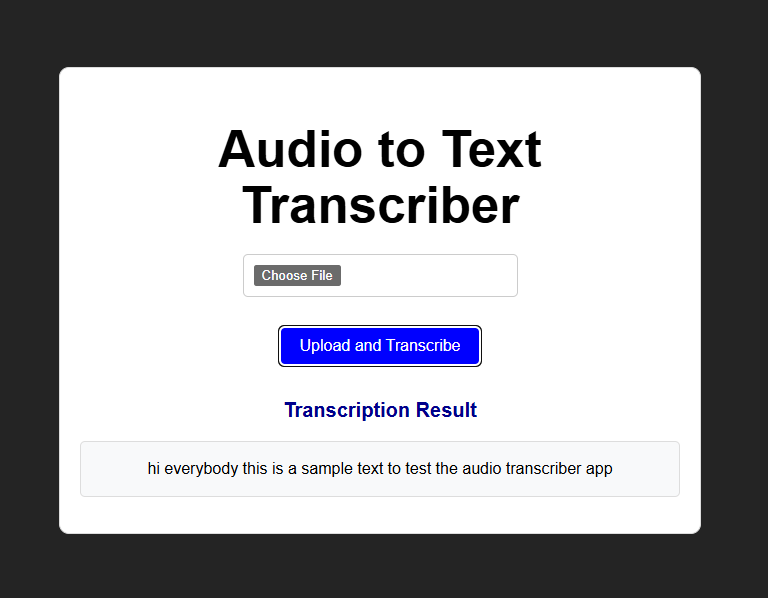

# 🎙️ Audio Transcriber API (Vosk + Spring Boot)

A free, offline-ready audio transcription backend built with **Spring Boot** and **Vosk**, supporting automatic format conversion and RESTful API for file upload. Paired with a lightweight **React** frontend for user interaction.

---

## 🧠 Features

- 🔊 **Offline transcription** with [Vosk](https://alphacephei.com/vosk/)
- ⚙️ Built with **Java 17**, **Spring Boot**, and **Maven**
- 🎧 Accepts multiple audio formats, auto-converts to 16kHz mono PCM
- 🐳 Fully **Dockerized backend**
- 🌐 Deployed backend + frontend on [Render.com](https://render.com/)
- 🛡️ CORS-enabled API for frontend interaction

---

## 🛠️ Technologies Used

| Layer      | Stack                            |
|------------|----------------------------------|
| **Backend**| Spring Boot, Vosk, Java Sound API |
| **Frontend**| React 18, Axios, Vite             |
| **DevOps** | Docker, Maven, Render.com         |

---

## 🚀 Try It Live

Frontend: [https://audiotranscriberfront.onrender.com](https://audiotranscriberfront.onrender.com)  
Backend API: [https://audiotranscriber-with-java.onrender.com](https://audiotranscriber-with-java.onrender.com)

> Upload a short audio file (MP3 or WAV) and get instant text transcription.

---

## 📂 Project Structure

```

backend/
├── Dockerfile
├── src/main/java/... (Spring REST controller)
├── src/main/resources/models/ (Vosk model)
└── application.properties

frontend/
├── App.jsx / AudioUploader.jsx
├── vite.config.js
└── package.json

````

---

## 🧪 Local Usage

**Backend**

```bash
# build and run the Docker container
docker build -t audio-transcriber-api .
docker run -p 8080:8080 audio-transcriber-api
````

**Frontend**

```bash
cd frontend
npm install
npm run dev
```

---

## 👨‍💻 About Me

I'm a backend developer focused on building clean, production-grade APIs. This project demonstrates:

* API design & file upload handling in Spring Boot
* Audio processing and format normalization
* Containerization & deployment skills using Docker and Render

**Fateme Soleymanian**
[LinkedIn](https://www.linkedin.com/in/fateme-soleymanian-b2713a225) • [GitHub](https://github.com/fatemesoleymanian) • [Portfolio](https://dark-cake-0993.on.fleek.co/)

---

## 🪪 License

This project is licensed under the MIT License.